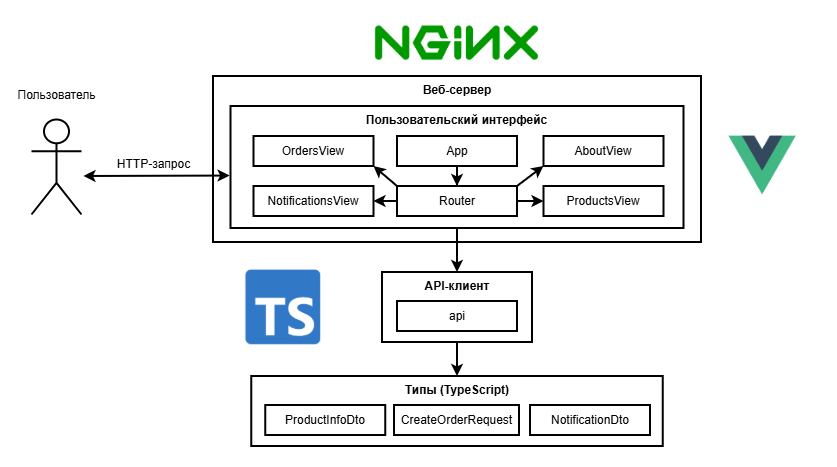

# Микросервисная система обработки заказов

Проект, реализующий микросервисную платформу для оформления заказов, управления запасами и отправки уведомлений. Разрабатывался в рамках дисциплины «Разработка Web-приложений» и был впоследствии доработан — добавлены механизмы мониторинга и улучшена архитектура.

**Проект не предназначен для реального использования и является учебным**.

<p>&nbsp</p>

## 1. Запуск приложения
### 1.1 Обзор

Пользователь может просматривать весь каталог товаров на соответствующей странице:

<details open>
  <summary>
    <strong>Развернуть/свернуть</strong>
  </summary>

  <p>&nbsp</p>

  <p align="center">
    
  </p>

</details>

<p>&nbsp</p>

Фильтрация товаров по ключевым словам — пользователь получает нужную позицию при необходимости:

<details open>
  <summary>
    <strong>Развернуть/свернуть</strong>
  </summary>

  <p>&nbsp</p>

  <p align="center">
    
  </p>

</details>

<p>&nbsp</p>

Для оформления заказа выберите товар, заполните форму и подтвердите покупку:

<details open>
  <summary>
    <strong>Развернуть/свернуть</strong>
  </summary>

  <p>&nbsp</p>

  <p align="center">
    
  </p>

</details>

<p>&nbsp</p>

Раздел «Уведомления» позволяет отслеживать отправленные сообщения по email. Уведомления сохраняются в базе данных — отправка через SMTP не используется:

<details open>
  <summary>
    <strong>Развернуть/свернуть</strong>
  </summary>

  <p>&nbsp</p>

  <p align="center">
    
  </p>

</details>

<p>&nbsp</p>

Раздел «О проекте» представляет собой информационный блок с описанием платформы:

<details open>
  <summary>
    <strong>Развернуть/свернуть</strong>
  </summary>

  <p>&nbsp</p>

  <p align="center">
    
  </p>

</details>

<p>&nbsp</p>

Интерфейс доступен в темной теме. Все разделы корректно отображаются после переключения:

<details open>
  <summary>
    <strong>Развернуть/свернуть</strong>
  </summary>

  <p>&nbsp</p>

  <p align="center">
    
  </p>

</details>

<p>&nbsp</p>

Интерфейс адаптирован под мобильные устройства:

<details open>
  <summary>
    <strong>Развернуть/свернуть</strong>
  </summary>

  <p>&nbsp</p>

  <p align="center">
    
  </p>

</details>

<p>&nbsp</p>

Метрики работы микросервиса управления запасами отображаются через Grafana:

<details open>
  <summary>
    <strong>Развернуть/свернуть</strong>
  </summary>

  <p>&nbsp</p>

  <p align="center">
    
  </p>

</details>

<p>&nbsp</p>

Визуализация метрик микросервиса уведомлений:

<details open>
  <summary>
    <strong>Развернуть/свернуть</strong>
  </summary>

  <p>&nbsp</p>

  <p align="center">
    
  </p>

</details>

<p>&nbsp</p>

Мониторинг микросервиса обработки заказов:

<details open>
  <summary>
    <strong>Развернуть/свернуть</strong>
  </summary>

  <p>&nbsp</p>

  <p align="center">
    
  </p>

</details>

<p>&nbsp</p>

Общий дашборд состояния всех баз данных PostgreSQL в проекте:

<details open>
  <summary>
    <strong>Развернуть/свернуть</strong>
  </summary>

  <p>&nbsp</p>

  <p align="center">
    
  </p>

</details>

<p>&nbsp</p>

### 1.2 Инструкция

- Склонируйте репозиторий:

```bash
git clone https://github.com/ArtemK64/distributed-shopping-platform.git
cd distributed-shopping-platform
```

- Переименуйте `.env.example` в `.env` и заполните необходимые переменные окружения.

- Запустите контейнеры:

```bash
docker-compose up --build
```

После запуска микросервисы постепенно переходят в состояние готовности, и только после этого становится доступен интерфейс. Веб-приложение будет открываться по адресу `http://localhost`, но с небольшой задержкой — только после того, как все backend-сервисы завершат инициализацию.

Кроме того, при старте выполняются миграции баз данных: автоматически загружается тестовый каталог товаров, а также заполняются категории, производители и склады (с помощью системы миграций Liquibase).

Сервисы будут доступны по следующим портам:

<details open>
  <summary>
    <strong>Развернуть/свернуть</strong>
  </summary>

  <table align="center">
    <thead>
      <tr>
        <th>Сервис</th>
        <th>Порт</th>
      </tr>
    </thead>
    <tbody>
      <tr>
        <td>PostgreSQL</td>
        <td>5432</td>
      </tr>
      <tr>
        <td>PostgreSQL Exporter</td>
        <td>9187</td>
      </tr>
      <tr>
        <td>Zookeeper</td>
        <td>2181</td>
      </tr>
      <tr>
        <td>Kafka</td>
        <td>29092, 9092</td>
      </tr>
      <tr>
        <td>Kafka UI</td>
        <td>8085</td>
      </tr>
      <tr>
        <td>Loki</td>
        <td>3100</td>
      </tr>
      <tr>
        <td>Prometheus</td>
        <td>9090</td>
      </tr>
      <tr>
        <td>Grafana</td>
        <td>3000</td>
      </tr>
      <tr>
        <td>Order Service</td>
        <td>8081</td>
      </tr>
      <tr>
        <td>Inventory Service</td>
        <td>8082</td>
      </tr>
      <tr>
        <td>Notification Service</td>
        <td>8083</td>
      </tr>
      <tr>
        <td><strong>API Gateway (Nginx)</strong></td>
        <td><strong>80</strong></td>
      </tr>
      <tr>
        <td>Container</td>
        <td>5000</td
      </tr>
    </tbody>
  </table>
</details>

<p>&nbsp</p>

## 2. Архитектура и реализация приложения

Приложение реализовано на микросервисной архитектуре и включает три ключевых сервиса: заказов, склада и уведомлений. Сервисы обмениваются событиями через брокер сообщений, а данные хранятся в отдельных базах. Пользователь оформляет заказ через интерфейс, после чего микросервисы проверяют остатки, обновляют статус и сохраняют уведомление.

### 2.1 Базы данных

Каждый микросервис использует собственную базу данных, структура которых представлена ниже в виде ER-диаграмм. База данных `inventorydb` отвечает за хранение информации о товарах и управлении складскими запасами:

<details open>
  <summary>
    <strong>Развернуть/свернуть</strong>
  </summary>

  <p>&nbsp</p>

  <p align="center">
    
  </p>

</details>

<p>&nbsp</p>

База данных `notificationdb` содержит шаблоны уведомлений, способы доставки и зафиксированные уведомления пользователям:

<details open>
  <summary>
    <strong>Развернуть/свернуть</strong>
  </summary>

  <p>&nbsp</p>

  <p align="center">
    
  </p>

</details>

<p>&nbsp</p>

`orderdb` используется микросервисом обработки заказов и хранит данные о клиентах, заказах и адресах доставки:

<details open>
  <summary>
    <strong>Развернуть/свернуть</strong>
  </summary>

  <p>&nbsp</p>

  <p align="center">
    
  </p>

</details>

<p>&nbsp</p>

### 2.2 Пользовательский интерфейс

Интерфейс состоит из отдельных экранов для просмотра товаров, оформления заказов и просмотра уведомлений. Все запросы от клиента проходят через веб-сервер, который перенаправляет обращения к внутренним сервисам:

<details open>
  <summary>
    <strong>Развернуть/свернуть</strong>
  </summary>

  <p align="center">
    
  </p>

</details>

<p>&nbsp</p>

### 2.3 Микросервис управления складскими остатками

Данный микросервис отвечает за обработку данных о товарах и их наличии на складах. Он получает заказы через брокер сообщений, проверяет остатки и принимает решение о подтверждении или отклонении заказа:

<details open>
  <summary>
    <strong>Развернуть/свернуть</strong>
  </summary>

  <p align="center">
    
  </p>

</details>

<p>&nbsp</p>

### 2.4 Микросервис уведомлений

Микросервис обрабатывает события о статусе заказов и формирует соответствующие уведомления для пользователей. Он хранит шаблоны сообщений, поддерживает разные каналы доставки и предоставляет API для просмотра отправленных уведомлений:

<details open>
  <summary>
    <strong>Развернуть/свернуть</strong>
  </summary>

  <p>&nbsp</p>

  <p align="center">
    
  </p>

</details>

<p>&nbsp</p>

### 2.5 Микросервис обработки заказов

Микросервис принимает заказы от пользователей, сохраняет их в базе данных и инициирует процесс проверки доступности товаров. Также взаимодействует с другими сервисами через брокер сообщений, обрабатывает ответы:

<details open>
  <summary>
    <strong>Развернуть/свернуть</strong>
  </summary>

  <p align="center">
    
  </p>

</details>

<p>&nbsp</p>

### 2.6 Система мониторинга и логирования

Используется централизованная система мониторинга и логирования. **Prometheus** собирает метрики из микросервисов и баз данных, а **Promtail** агрегирует логи контейнеров и передает их в **Loki**. Для визуализации используется **Grafana**, где настраиваются дашборды по метрикам и логам:

<details open>
  <summary>
    <strong>Развернуть/свернуть</strong>
  </summary>

  <p align="center">
    
  </p>

</details>

## 3. Лицензия

Проект распространяется под лицензией [MIT](LICENSE)
